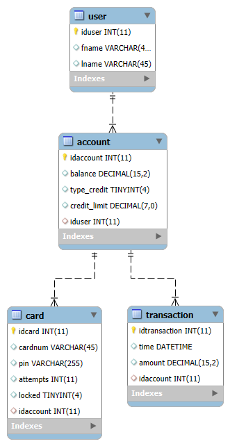
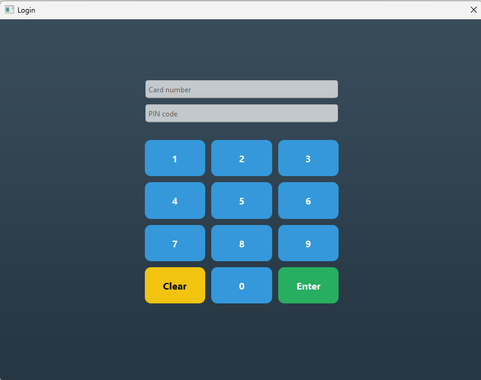
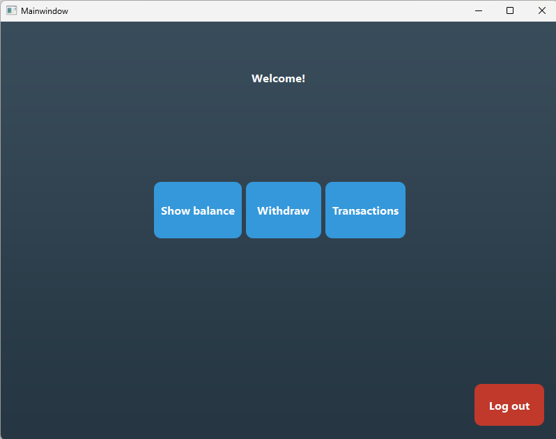
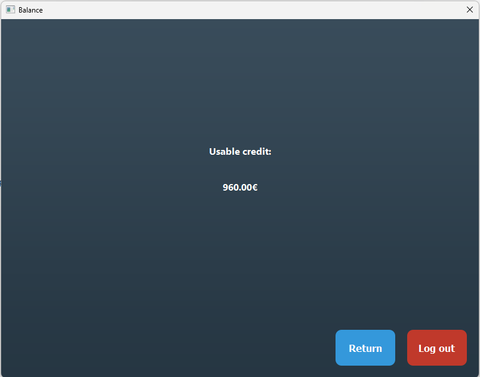
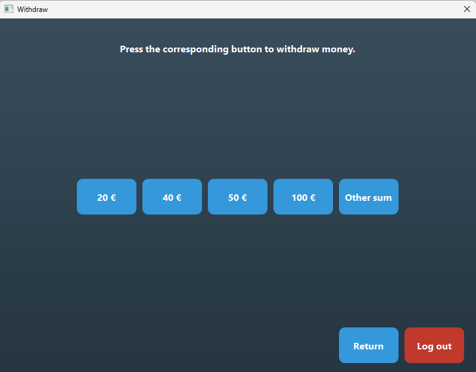
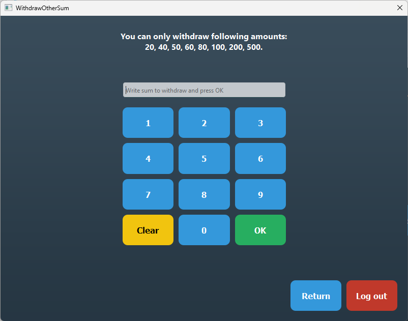
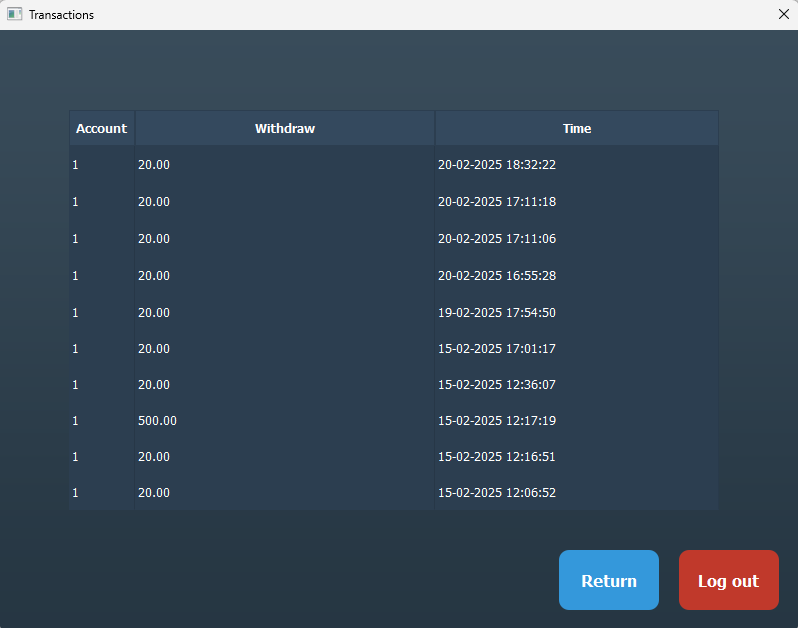

# group_20

## Virtual ATM 

### Description

The goal of this project was to develop a graphical user interface, a database, and an API for a virtual ATM system. 
The Virtual ATM includes the following features:

- Secure login
- Check account balance
- View transaction history
- Withdraw money
- Logout functionality
- Automatic logout due to inactivity
- Modern and user-friendly interface
The ATM's user interface was implemented as a Qt Widget application. 
The database was built using MySQL, and the RESTful API was developed with Node.js and Express.js. 
The backend and database were deployed on a Linux server.

All CRUD (Create, Read, Update, Delete) operations were implemented for the SQL database tables.

### Technology stack

|Tehnology    | Implementation         |
|:-----------:|:----------------------:|
|User inteface| Qt Widget              |
|REST API     | Node.js and express.js |
|Database     | MySQL                  |

### ER diagram of the database:

### User interface

### Results

We developed a full-stack software solution and successfully collaborated as a team.
All functionalities worked seamlessly together, and the UI was modern and clean.
Features were continuously tested for reliability and performance with Postman throughout the development process.

### Communication

We used GitHub Kanban for task management. 
Discord and Microsoft Teams were used to communicate and problem solve.

### What we learned

Software development is challenging and requires strong problem-solving skills, research, discipline, and teamwork.
Effective communication is essential for a successful project.
GitHub proved to be an efficient collaboration and version control platform.

Through this project, we gained valuable hands-on experience with:

- Qt for GUI development
- HTTP protocols
- Node.js & JavaScript for backend development
- Linux server management
- Ansible for automation
- Debugging and troubleshooting
- UML and project documentation

### Possibilities to expand program

- Implementing an admin interface for managing accounts and transactions
- Adding enhanced security measures such as multi-factor authentication (MFA)
- Developing a separate application for data and user management